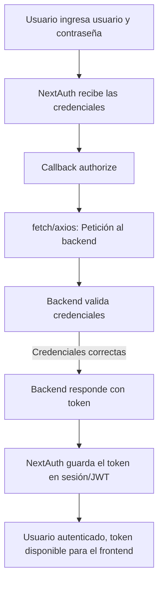

```mermaid
graph TD;
    A[Usuario ingresa usuario y contraseña] --> B[NextAuth recibe las credenciales]
    B --> C[Callback authorize]
    C --> D[fetch/axios: Petición al backend]
    D --> E[Backend valida credenciales]
    E -->|Credenciales correctas| F[Backend responde con token]
    F --> G[NextAuth guarda el token en sesión/JWT]
    G --> H[Usuario autenticado, token disponible para el frontend]
```
