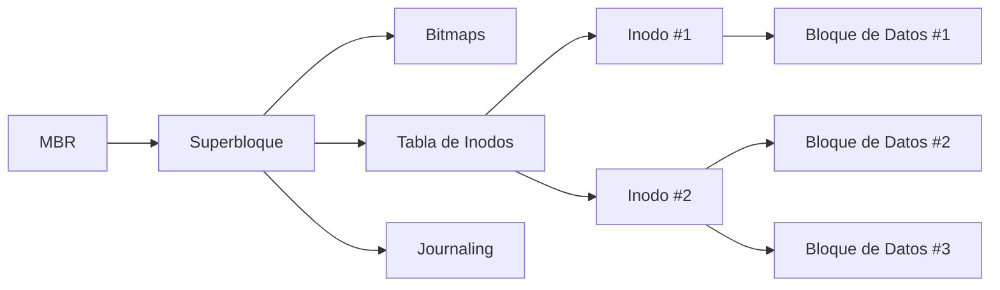

```mermaid
flowchart LR
    MBR --> SB[Superbloque]
    SB --> BM[Bitmaps]
    SB --> TI[Tabla de Inodos]
    TI --> IN1[Inodo #1]
    TI --> IN2[Inodo #2]
    IN1 --> BD1[Bloque de Datos #1]
    IN2 --> BD2[Bloque de Datos #2]
    IN2 --> BD3[Bloque de Datos #3]
    SB --> JR[Journaling]
```

---
